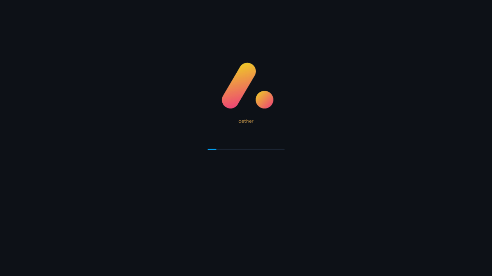
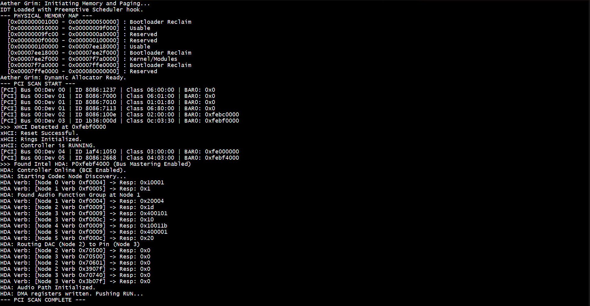
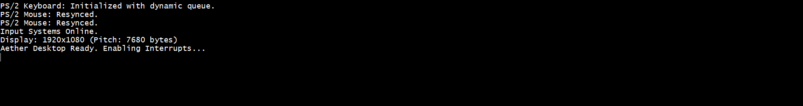

# Aether Grim

**Aether Grim** is an experimental **x86-64 operating system kernel** written in **Rust**, developed to explore low-level systems engineering concepts including kernel architecture, memory management, device drivers, graphics subsystems, and hardware interaction.

The project is part of the broader **Aether OS ecosystem**, a set of experimental operating systems targeting different architectures and computing environments.

Aether Grim focuses on building a **desktop / server capable kernel for modern x86-64 hardware**, implemented from scratch.

---

## Overview

Aether Grim is a **monolithic kernel** designed to interact directly with hardware using custom drivers and kernel subsystems.

The project explores key areas of operating system design including:

- Kernel initialization
- Memory management
- Hardware drivers
- Interrupt handling
- Graphics rendering
- Input subsystems
- Kernel architecture design

The goal of the project is to understand how modern operating systems function **from bootloader handoff to graphical environments**.

---

## Screenshots

### Graphical Splash / Desktop Environment



---

### Kernel Boot Output (Serial Console)




---

## Boot Sequence Overview

The system boot process follows a staged initialization pipeline:

1. **Firmware / Bootloader**
   - Limine bootloader loads the kernel and prepares the execution environment.
   - Framebuffer and memory map information are passed to the kernel.

2. **Kernel Entry**
   - Control is transferred to the kernel entry point.
   - CPU state and initial execution environment are validated.

3. **Architecture Initialization**
   - Interrupt Descriptor Table (IDT) is configured.
   - Programmable Interrupt Controller (PIC) is initialized.
   - Timer interrupts are enabled.

4. **Memory Initialization**
   - Physical memory manager is initialized.
   - Paging structures are created and activated.

5. **Hardware Discovery**
   - PCI bus enumeration begins.
   - Devices are identified and registered.

6. **Driver Initialization**
   - Core hardware drivers are initialized.
   - Input and graphics subsystems are activated.

7. **Graphics Startup**
   - Framebuffer renderer is initialized.
   - GUI compositor begins rendering to the backbuffer.

8. **System Ready**
   - Input devices become active.
   - The graphical interface becomes interactive.

---

## Implemented Features

### Kernel Core

- x86-64 kernel using the **Limine bootloader**
- early kernel initialization pipeline
- interrupt descriptor table (IDT)
- programmable interrupt controller setup
- kernel runtime environment

---

### Memory Management

- physical memory manager
- paging structures
- kernel memory allocation
- virtual memory initialization

---

### Hardware Drivers

Current hardware support includes:

- **PCI device enumeration**
- **PS/2 mouse driver**
- **xHCI USB controller interface**
- interrupt-driven device communication

---

### Graphics Subsystem

The graphical pipeline includes:

- framebuffer renderer
- backbuffer rendering system
- GUI compositor
- alpha blending
- window layering support

These components enable graphical output and a basic desktop interface.

---

### Input Systems

- interrupt-driven **PS/2 mouse input**
- keyboard input handling
- cursor movement and GUI interaction

---

## Driver Initialization Flow

Hardware drivers are initialized in a layered order during system startup:

1. **PCI Enumeration**
   - The kernel scans the PCI bus.
   - Devices are detected and registered.

2. **Controller Drivers**
   - xHCI USB controller initialization.
   - Device interfaces are prepared.

3. **Legacy Input Devices**
   - PS/2 controller initialization.
   - Mouse driver activation.
   - Interrupt-driven input packet handling.

4. **Graphics Initialization**
   - Framebuffer renderer setup.
   - Backbuffer allocation.
   - Compositor activation.

This layered initialization ensures that **core hardware services are available before higher-level subsystems begin operation**.

---

## Architecture

The kernel is organized into modular subsystems:

```
kernel/
 ├── arch/
 │    └── x86_64/
 │         ├── cpu initialization
 │         ├── interrupt management
 │         └── paging
 │
 ├── drivers/
 │    ├── pci
 │    ├── ps2
 │    └── xhci
 │
 ├── memory/
 │    ├── physical memory manager
 │    └── paging subsystem
 │
 ├── gui/
 │    ├── compositor
 │    ├── renderer
 │    └── window system
 │
 └── kernel initialization
```

---

## Building and Running

Aether Grim currently runs in a virtualized environment.

### Requirements

- Rust toolchain
- Limine bootloader
- QEMU
- x86-64 build target

### Example Run

```
cargo build
qemu-system-x86_64 -cdrom build/aethergrim.iso
```

Actual build commands may vary depending on the local build setup.

---

## Design Goals

Aether Grim aims to explore:

- low-level hardware interaction
- operating system kernel architecture
- driver development
- graphics pipelines in operating systems
- systems programming using Rust

The project prioritizes **deep understanding of kernel subsystems and hardware interaction**.

---

## Future Development

Planned areas of development include:

- filesystem implementation
- networking stack
- improved input subsystem
- user-space process model
- graphical applications
- optional headless server mode

---

## Aether OS Ecosystem

Aether Grim is part of the **Aether OS project family**:

| Project | Architecture | Purpose |
|--------|-------------|--------|
| Aether Grim | x86-64 | Desktop / server OS kernel |
| Aether WebOS | ARMv8 | Headless infrastructure operating system |
| Aether EdgeCloud | ARM | Infrastructure and distributed systems experimentation |

---

## Author

Aritrash Sarkar  
Computer Science & Engineering student focused on:

- Operating systems
- Kernel engineering
- Systems programming
- Computer architecture

GitHub: https://github.com/aritrash

---

## License

The source code for **Aether Grim is not publicly released**.

This repository is intended for documentation, demonstration, and development tracking purposes.